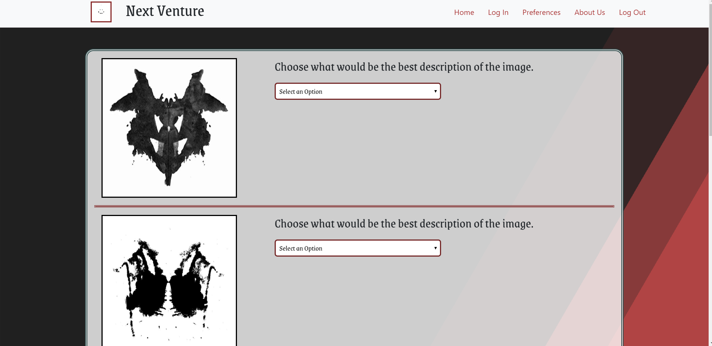
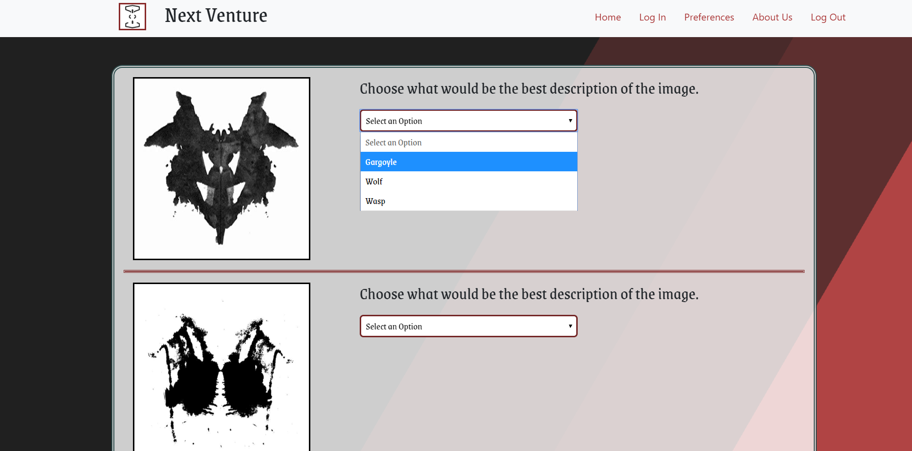
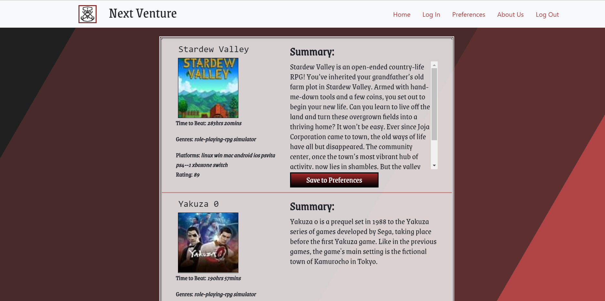

## Next Venture
A group project for the SMU coding bootcamp, made to demonstrate knowledge of full stack applications, including node, express, and handlebars. This is a project designed to take input from the user on a variety of attributes related to videogames, such as its length, price, genre, etc. It will then query a database with approximately 50 videogames, and return the 5 that match preferences most closely. Each match will display video, description, a link to buy and other relevant info. There will also be an option to subscribe and recieve emails when a videogame close to the user’s preferences is input, and potentially more depth of information. There will also be an about us page and user guide.

## Project Features
* Overview
* Technology Used
* Challenges
* Final Thoughts
* Overview
This fun offbeat app helps users match with new video games by using the results of a series of Rorschach tests. The results from the tests are transformed into a list of games from the IGDB game database. Users can also create accounts/login, and save the games they clicked with to come back to later.

Check out this project deployed to heroku [here](https://next-venture.herokuapp.com/)

## Demonstration of the website features

This is an image of the homepage:

This is an image of one of the options that is available to choose:

This is an image of the list of summaries randonmly display upon completion of the Rorshach test:

## Technology-Used
* Passport User Auth Library
* Node
* Express
* Handlebars
* Sequelize
* MySQL
* Axios
 ## Challenges
As is often the case, the greatest challenges this project presented came in the form of a technology used for the first time, in this case user authentication and login. This was accomplished using the Passport library, which was at first glance quite complex, but steadily became more simple as we wove the authentication code into our app. Not as technically difficult, but very time intensive, was deciding how to translate the results from the rorschach tests into queries that would almost always retrieve games, while also being relevant to the results of the tests.

## Final-Thoughts
This project was very time intensive, but generally went very smoothly. We tried out some new things with this one, including stored user data and an animated background. When it was finished, I was glad to see it was as fun to play around with as I'd hoped. Go ahead and try it out!
